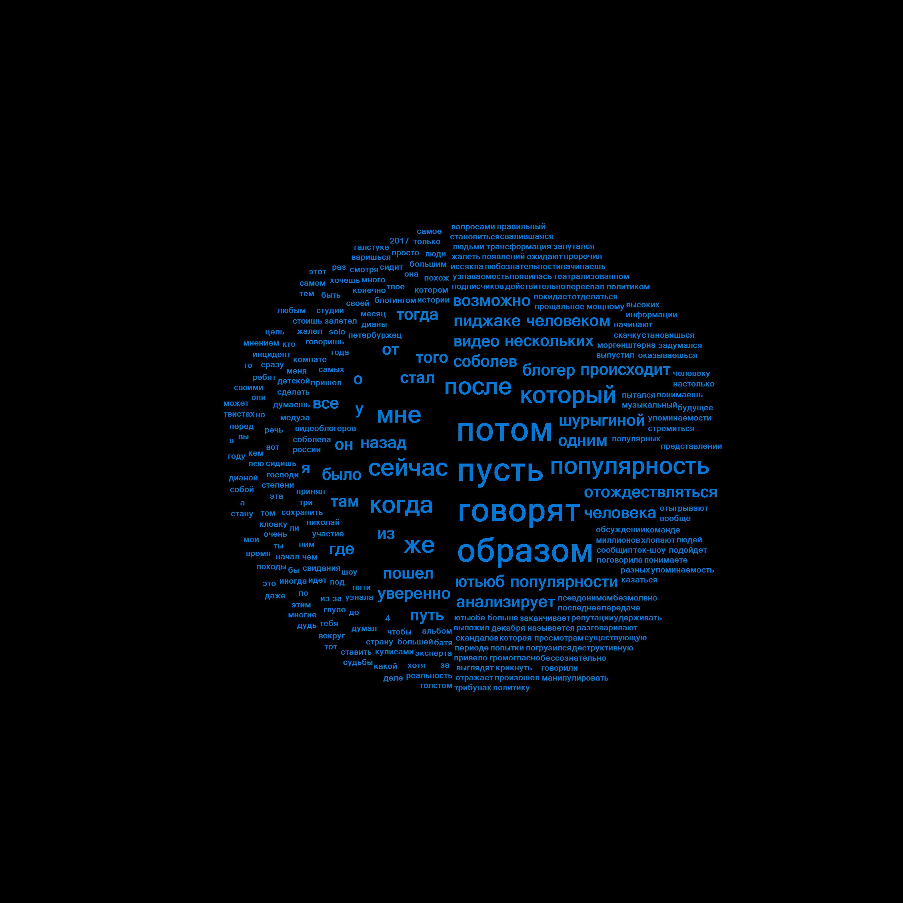

# Console Words Cloud Application 

Примеры настроек:

1. [source](examples/1/)
{"options", "--words", wordPath, "--boring", boringPath, "--format", "jpeg", "--color", "13", "-c", "20"}

2. [source](examples/2/)
{"options", "--words", wordPath, "--boring", boringPath, "--format", "png", "--color", "57", "-c", "17"}

3. [source](examples/3/)
{"options", "--words", wordPath, "--boring", boringPath, "--format", "bmp", "--color", "110", "-c", "24", "--imageName", "any"};
