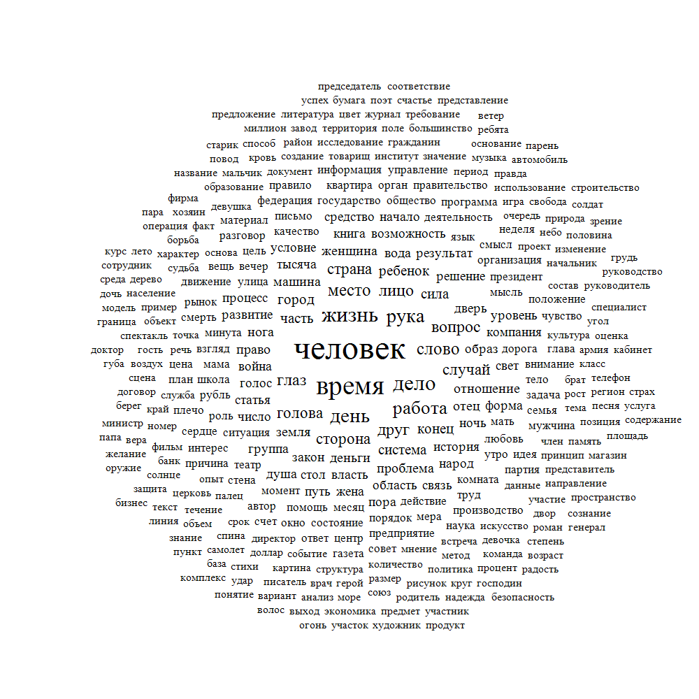
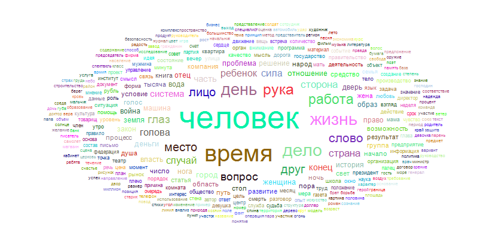

# Tag Cloud

## Commands

For command information check `--help`

## Command line arguments examples

- For cloud with defaults settings: 

    `-i TestText.txt -o Output.png`

- For customized cloud: 

    `-i TestText.txt -o Output.png -z ellipse -w 800 -h 400 -b white -f arial -l 5 -p 40 -k random`

## Cloud examples

