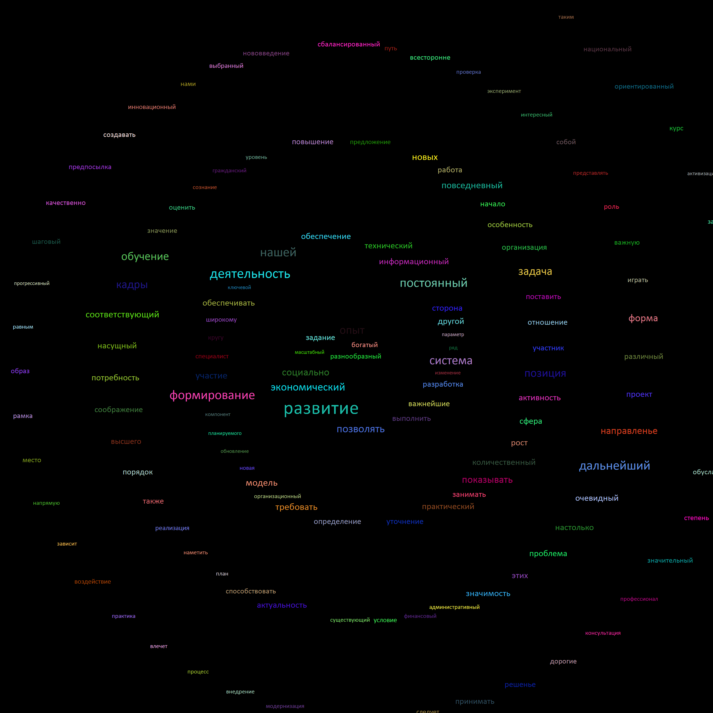

# Cloud Layouter

## usage:

#### you can check all arguments by help(-h)

#### example:

```TagCloud.exe -i TagCloud/Words.txt -o TagCloud/Output.png -b black -f Calibri -h 2200 -w 2000 -g circle```

## Examples of cloud


