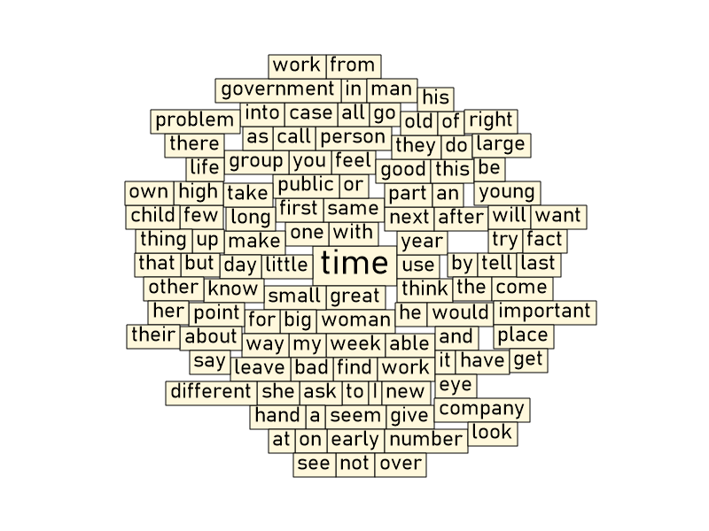
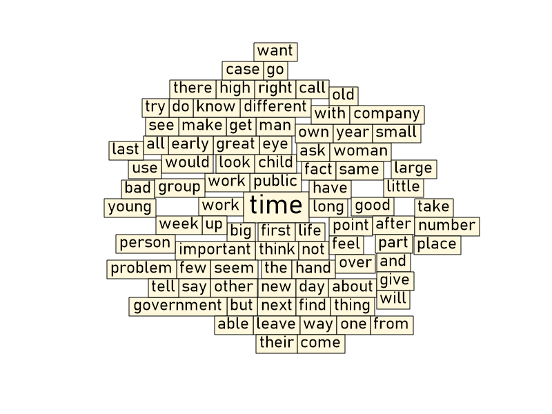

#### Пример запуска:
> C:\>TagCloudGenerator.exe DoubleFontsCloud CommonWordsCloudFilename.txt -e ExcludedWords.txt

_Словари для генерации расположены в директории `Vocabularies`_

#### Команда `DoubleFontsCloud` - по умолчанию настроена на генерацию облака популярных слов.
* --mutual_font                         (Default: Bahnschrift SemiLight) All words will have the same font type (but can have different sizes).

* --background_color                    (Default: #FFFFFFFF) Background color of cloud image.

* --font_sizes                          (Default: 30_18) Font sizes for each tags group.

* --tag_colors                          (Default: #FF000000_#FF000000) Tag colors for each tags group.

* -s, --image_size                      (Default: 800x600) Cloud image size in format: [width]x[height]

* -e, --excluded_vocabulary_filename    Words from this file will be excluded from cloud.

* --help                                Display this help screen.

* --version                             Display version information.

* cloud_vocabulary_filename (pos. 0)    Required. Path to file with all cloud words. Each word should be in separate line.

##### Most commonly words cloud по умолчанию:

##### Most commonly words cloud с опцией `--excluded_vocabulary_filename`:

#### Команда `FourFontsCloud` - по умолчанию настроена на генерацию Web cloud.

* --mutual_font                         (Default: Bahnschrift SemiLight) All words will have the same font type (but can have different sizes).

* --background_color                    (Default: #FF00222B) Background color of cloud image.

* --font_sizes                          (Default: 60_22_18_13) Font sizes for each tags group.

* --tag_colors                          (Default: #FFFFFFFF_#FFFF6600_#FFD45500_#FFA05A2C) Tag colors for each tags group.

* -s, --image_size                      (Default: 800x600) Cloud image size in format: [width]x[height]

* -e, --excluded_vocabulary_filename    Words from this file will be excluded from cloud.

* --help                                Display this help screen.

* --version                             Display version information.

* cloud_vocabulary_filename (pos. 0)    Required. Path to file with all cloud words. Each word should be in separate line.

#### Web cloud
