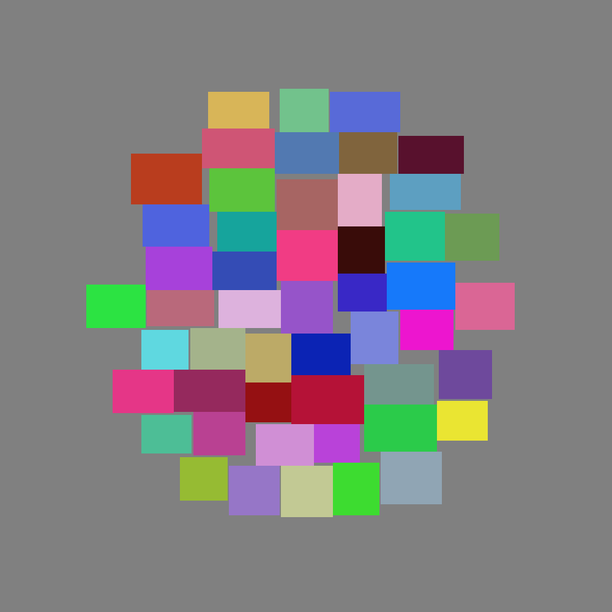
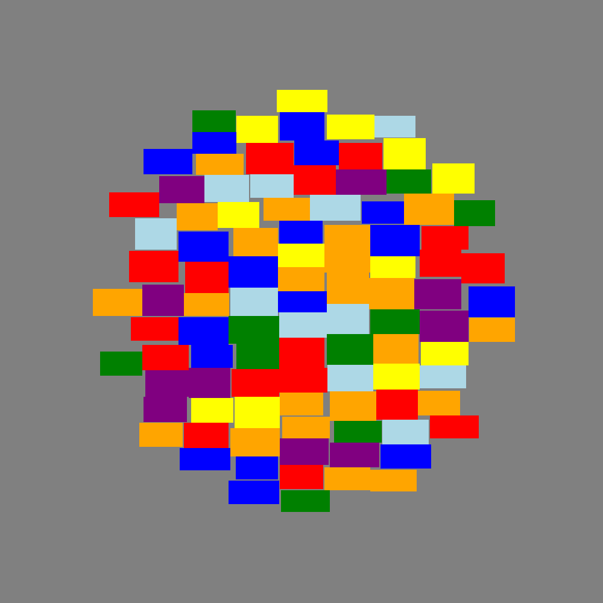
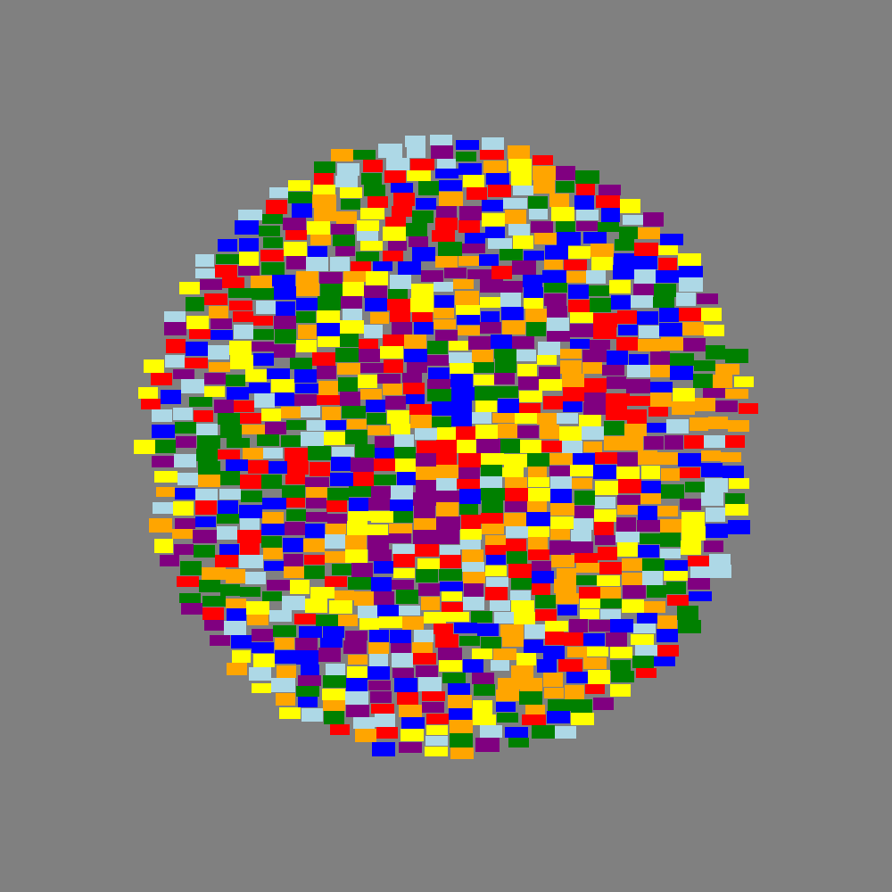
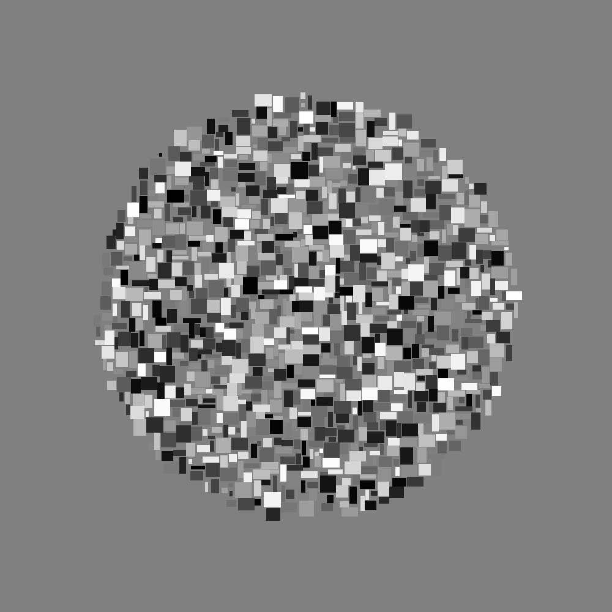

# Сгенерированные картинки

_______________________

## Вариант 1:

- __Кол-во точек__: _50_
- __Размеры__: _[30, 50] x [20, 30]_
- __Раскраска__: случайно

_______________________

## Вариант 2:

- __Кол-во точек__: _100_
- __Размеры__: _[40, 50] x [20, 30]_
- __Раскраска__: радуга

_______________________

## Вариант 3:

- __Кол-во точек__: _1000_
- __Размеры__: _[40, 50] x [20, 30]_
- __Раскраска__: радуга

_______________________

## Вариант 4:

- __Кол-во точек__: _1000_
- __Размеры__: _[10, 50] x [10, 30]_
- __Раскраска__: оттенки серого

_______________________