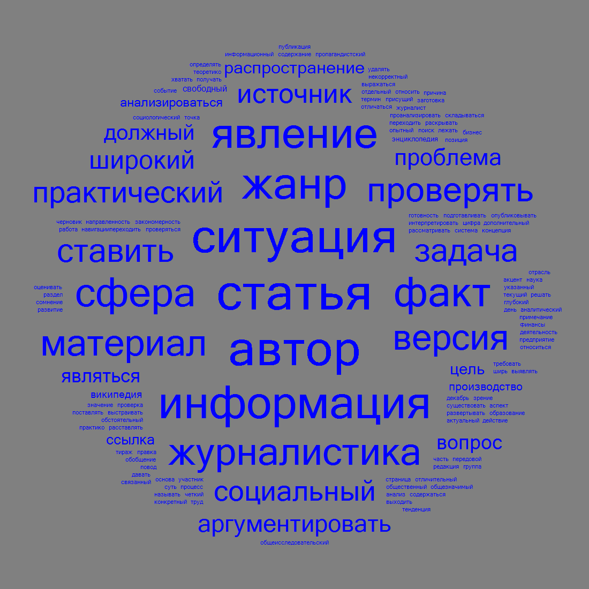

# Задание Облако тегов
>TagsCloudContainer.exe -i Input.txt

>TagsCloudContainer.exe -i Input.txt t 1 -b 1

from

*------------------------------*  
Мой дядя самых честных правил,  
Мой дядя самых честных правил,  
Когда не в шутку занемог,  
Он уважать себя заставил  
И лучше выдумать не мог.  
Его пример другим наука;  
Но, боже мой, какая скука  
С больным сидеть и день и ночь,  
Не отходя ни шагу прочь!  
Какое низкое коварство  
Полуживого забавлять,  
Ему подушки поправлять,  
Печально подносить лекарство,  
Вздыхать и думать про себя:  
Когда же черт возьмет тебя!  
*-----------------------------*
