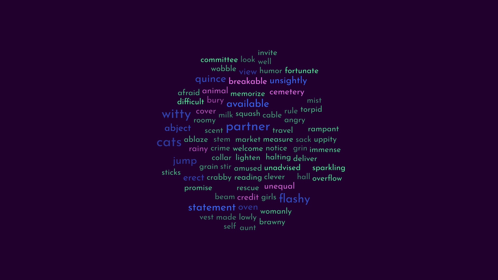

## TODO:
**Исходный текст**:
- [x] Источником данных должен быть файл со словами по одному в строке.

**Предобработка слов**:
- [ ] На этапе предобработки, приведи все слова к нижнему регистру и исключи скучные слова

**Формат результата:**
- [ ] В качестве результата программа должна генерировать png-файл.
- [ ] Должна быть возможность задать цвета, шрифт и размер изображения.

**Алгоритм**
- [x] Сделай так, чтобы по одному тексту можно было сгенерировать несколько облаков тегов с помощью разных алгоритмов или одного алгоритма с разными настройками.

**GUI или Console**:
- [ ] Организуй код так, чтобы было легко сделать оба вида клиентов — и клиента командной строки, и GUI приложение с вводом параметров и интерактивным просмотром.
- [ ] Реализуй одного клиента по выбору

## Perspective:
**Исходный текст**:
- [ ] поддерживать разные форматы файлов (txt, doc, docx, ...)

**Предобработка слов**:
- [ ] дать возможность влиять на список скучных слов, которые не попадут в облако.
- [ ] поддерживать ввод данных из литературного текста, с приведением слов в начальную форму.
- [ ] дать возможность выбирать только определенные части речи (например, только существительные)

**Формат результата**:
- [ ] поддерживать разные форматы изображений.
- [ ] поддерживать разные алгоритмы расцветки слов.

**Алгоритм**:
- [ ] реализовать несколько алгоритмов формирования облака тегов.

**GUI или Console**:
- [ ] реализуй второго клиента.

