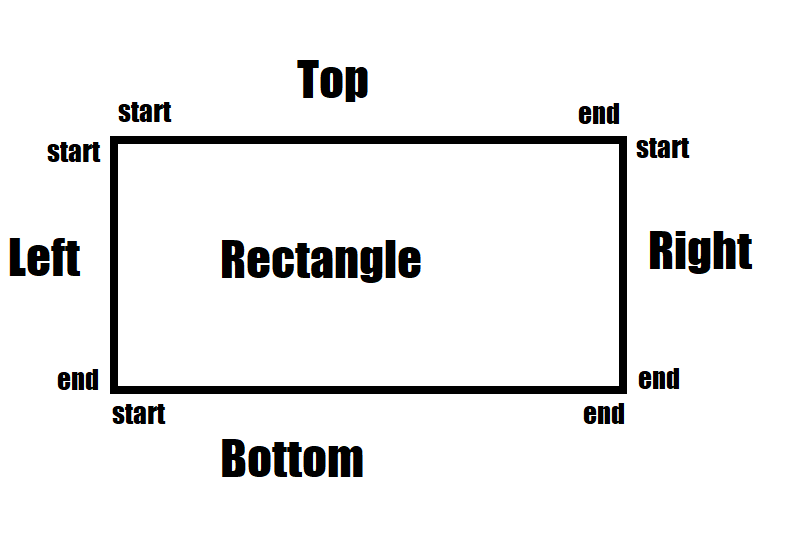
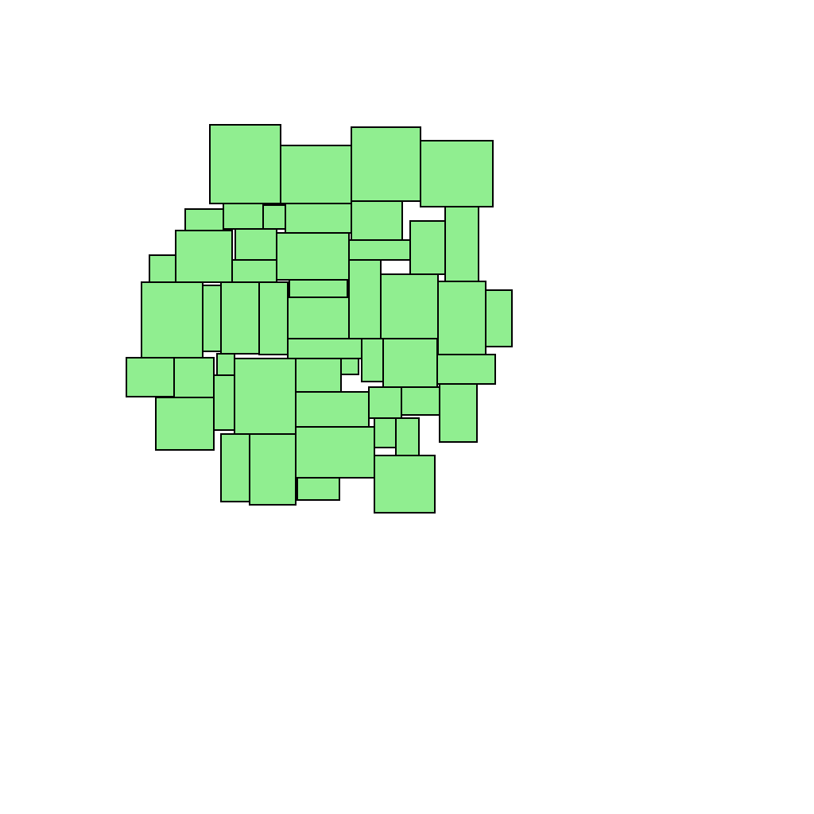
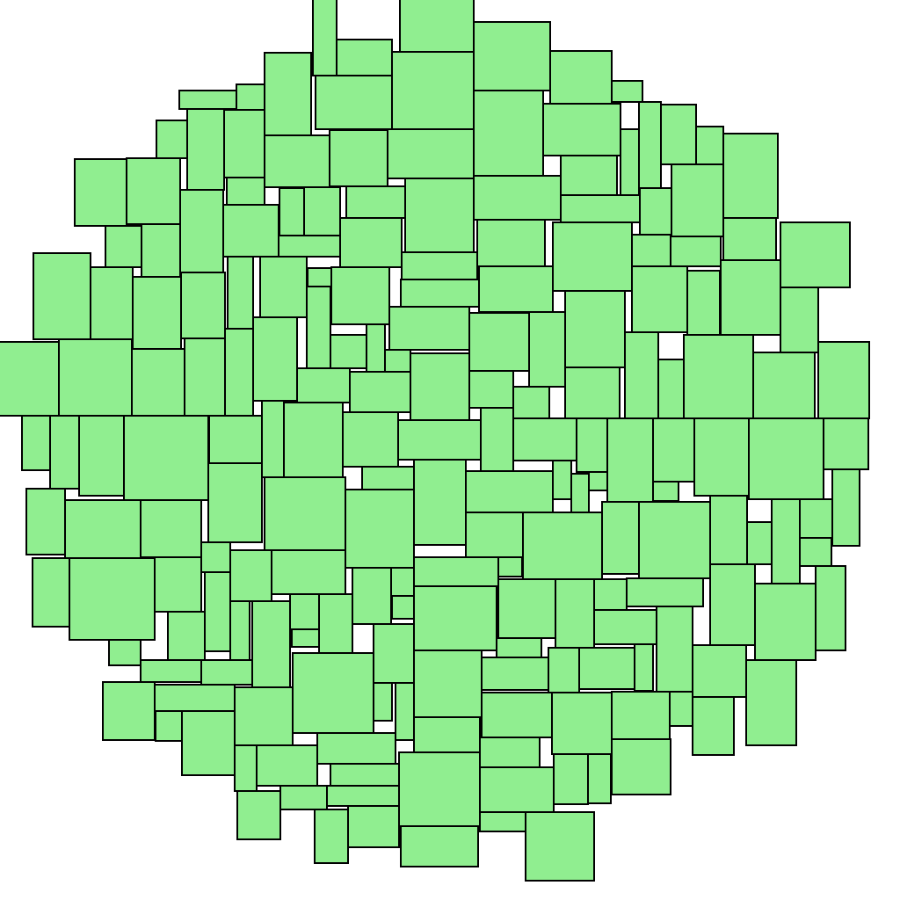

# ReadMe
здесь изложен алгоритм лежащий в основе работы класса CircularCloudLayouter

## Наблюдения

* Добавлять прямоугольник просто в пространство неоптимально, всегда можно сдвинуть его вплоть до первой границы имеющейся фигуры

* Оптимальное добавление при только одной касательной стороне возможно только если через центр прямоугольника проходит ось координат

картинка поясняющая разметку прямоугольника

### Алгоритм

Из наблюдения 1 становится понятно что нас интересует именно граница уже имеющегося облака.
Мы храним все отрезки которые составляют границу уже собранного облака. 
При добавлении мы пытаемся присоединить к облаку новый прямоугольник по ребру, проверяя крайние положения.
Для случая когда сторона прямоугольника меньше отрезка:
Если через отрезок не проходит ось center граничное условие всегда оптимальнее чем присоединение посреди отрезка.
В противном случае наблюдение 2.
Для случая когда сторона прямоугольника больше отрезка:
Можно продлить отрезок в обе стороны до первого ограничивающего отрезка.
Если все еще сторона прямоугольника больше отрезка - следующая итерация.
Иначе граничные случаи.
После каждого добавления нового прямоугольника вызывается спец. метод (StackSegments) удаляющий внутренние отрезки.

#### StackSegments

Данный метод удаляет отрезки внутри облака. Для анализа используется автомат. Отрезок становится внутренним, когда по нему или его части присоединяется прямоугольник. Поэтому для каждой стороны прямоугольника нам достаточно проверять только те отрезки, которые лежат на одной прямой с стороной прямоугольника. Далее берутся точки начала и конца отрезков на прямой и сортируются по возрастанию. Автомат идет по точкам и ищет точки которые принадлежат сразу двум отрезкам. Если отрезки были противоположными сегментами, то отрезки между этими точками внутренние, их можно удалить. Если отрезки одного типа сегмента, то оставляем только один отрезок, второй совпадает с ним.

##### Примеры

