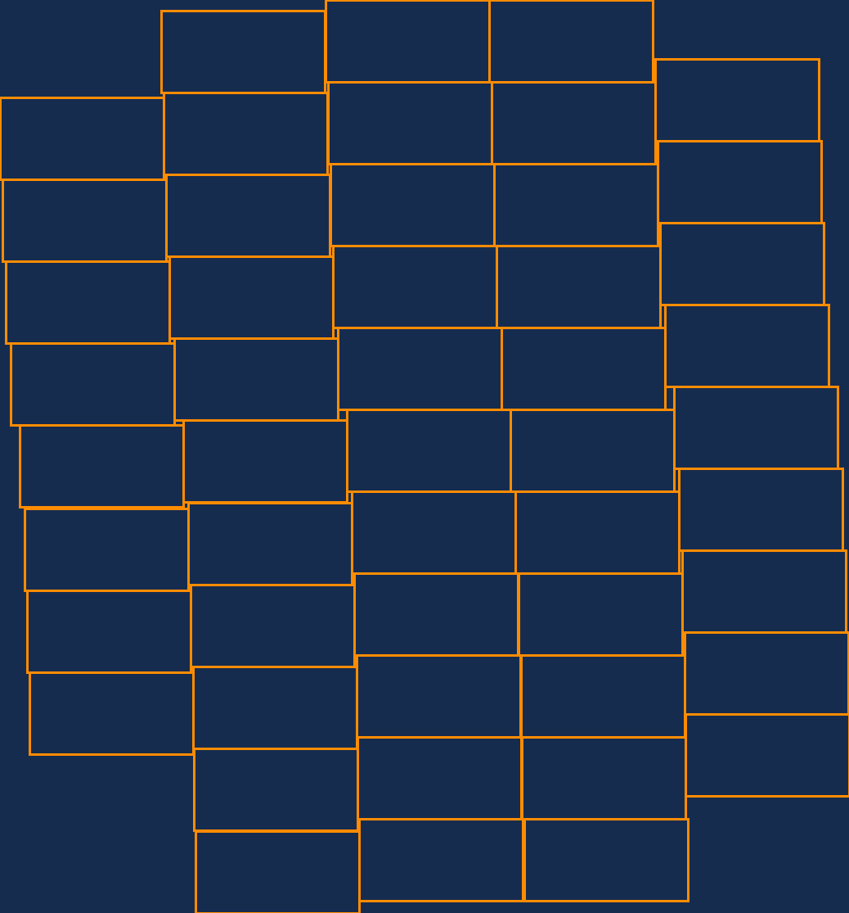
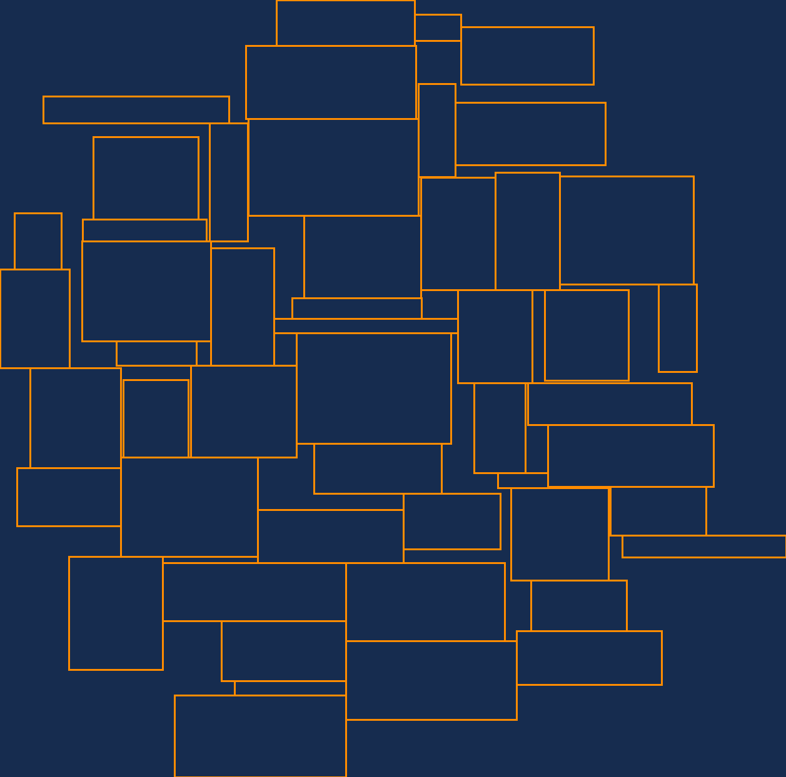

## Tags cloud visualization
    CircularCloudLayouter class makes up a cloud of rectangles. The form of the cloud is close to the circre and rectangles do not intersect each other.
### Visualization examples
    50 rectangles with the same size 200 x 100
    

    50 rectangles with random sizes between 50 x 20 and 300 x 200
    

